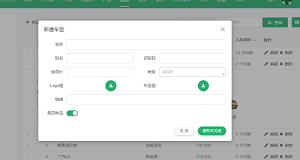
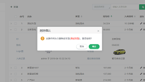
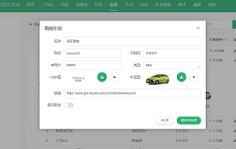
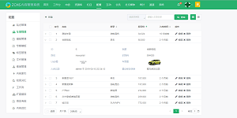
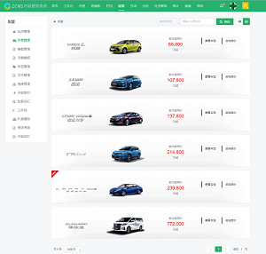
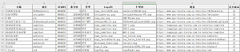

# jeecg-boot-study

#### 一、介绍

该仓库是 jeecg-boot 开源项目学习，功能仿照开发、实现的仓库。
不得不说在把该项目大概熟悉了之后，借助代码生成功能来开发其他功能真的很快、很爽。但是也不能太依赖代码生成器，不局限于它。

##### 二、我仿照实现的功能：
    
 1. 车型管理（在jeecg-boot-module-system/src/main/java/org/jeecg/modules/car目录，相关表sql在db/test_demo_car.sql）

- 需求原型页面：  

  - 新建车型：
        
      
        
  - 删除车型：
        
     
    
  - 编辑车型：
  
    
     
  - 车型列表1：网格视图
      
      
      
  - 车型列表2：列表视图
      
     
    
- 示例数据截图：

      
    
- 从接触项目至今，学习和具体功能点实现简略过程：

  1. 环境搭建：根据该项目文档，搭建环境，将项目跑起来。 
  2. 设计表结构：根据页面原型和示例数据设计表结构。
  3. 学习代码生成器的使用（看文档）：借助其在线表单开发功能(可设计表，此时才发现它有这样的功能，不然第 2 步就能少花点时间了)，生成基本的后台 curd 方法和前台页面。
  4. 在现有项目基础上直接加包完成功能开发： 在 modules 包下新建一个 car 包，把生成的代码扔进去，把功能和页面效果展示出来（参考系统现有页面、实现代码和原型页面来修改自己的），并在此基础上，拓展功能，如单字段查询。
  5. 优化完善：根据与龙哥的沟通反馈和自己理解分析、理解需求，不断完善、优化功能。  
       
    
- 遇到的问题：

  1. 用 postman 测试功能，发现 JeecgBoot 后台的所有请求访问，增加了 token 机制，所以不能直接访问后台，而需要通过前台登录在界面上操作才能访问。
  2. 图片上传图片存在哪？
        
        
- 解决办法：
  1. 在 ShiroConfig 配置类中排除对请求的拦截。 
  2. 1）项目根目录下提供一个img目录，随着图片不断增加会导致项目过大问题。
     2）存在本地电脑磁盘，非C盘即可，图片目录按日期命名分别存储，在linux系统上没有盘符的概念，图片存储路径直接是 /xxx（某个目录）/img   【注：/代表根目录。】

- 经验小结：

  1. 前台所有增删改查的功能在后台尽量分别只提供一个接口来实现，不要每一个小功能点（比如根据name查询、根据id删除等）都写一个接口。
    
 
 
 
 2. 对车型管理的功能做权限管理 

#### 软件架构
软件架构说明

#### 安装教程

1.  xxxx
2.  xxxx
3.  xxxx

#### 功能运行说明

1.  车型图片显示注意在项目路径、端口更改后也需要在 application-dev.yml 配置文件中做响应修改。
2.  xxxx
3.  xxxx

#### 参与贡献

1.  Fork 本仓库
2.  新建 Feat_xxx 分支
3.  提交代码
4.  新建 Pull Request
